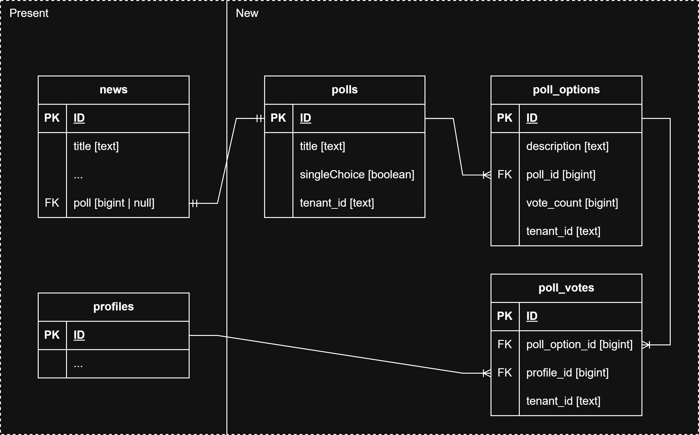

# Technical Decisions

## Multi-tenant

Multi-tenancy is a requirement because:

- Single login for all websites.
- Easier maintenance and migrations.

With supabase there are a few ways we can do multi-tenancy:

1. Have Multiple projects
2. Have a Single project with multiple schemas
3. Have a Single project, with 1 common schema, using RLS (Row Level Security) to ensure data separation

Decision: 3. Why?

- A single project is easier to manage and deploy
- Same for a single common schema... and multiple schemas wouldn't give any security benefits
- With RLS, we can ensure, based on an Environment Variable, only the respective rows of that tenant are queried.

How?

- Each table has a tenant_id column
- On each request, to supabase (via its sdk) we pass a header 'x-tenant-id' with the process.env.TENANT_ID variable, which is set for each app, via Fly.io secret.

## Comment Counts

Currently we can sort questions/research/library by the number of comments.
With supabase there are a few ways we can do this:

1. A comment count view
2. A comment count materialized view
3. Triggers, where the main table has a comment_count column which is updated when a comment is inserted/deleted

Decision: 3. Why?

- A simple view isn't performant, would be querying for the total on each query.
- A materialized view keeps state and is simple enough to update it, but doesn't support RLS. (Would be a better contender if it supported RLS)

How?

- Whenever a comment is created or deleted, it triggers the update_comment_count function.
- The function checks the Operation kind (Insert/Delete), the source_type and source_id.
- From the source_type it will update the according content total (library, research, questions) that matches the source_id

## Research Search

Research is composed by:

1. research main item
2. research updates

When searching for `research`, we want to search both the main item and its updates.
To search using postgres textSearch, all info needs to be stored in a vector column.
If updates were stored in the main research item as json, it would be straightforward to index.
Having updates being stored in their own table is beneficial:

- easier CRUD
- enforcing a schema ensures data integrity and structure compared to json
- easier to extract metrics

The solution is to have a `tsvector` column that also contains update data which comes from the `research_updates` table.
To build the column data, a `combined_research_search_fields(research_id)` is used to combine all data (main + updates).
To automate indexing from `research_update` an INSERT/UPDATE trigger is needed.

## Notifications

Notifications are sent in batch to avoid hitting resend limits.
Batches of 100 emails, wait 1 second per batch.

Notifications are sent to users who subscribed a specific kind of content, when said content is created.
There is a `subscriptions` table to keep track of that.

Current notification types:

- new research upgrade
- new comment (for each of these content types - news, research_updates, questions, projects)
- new reply (to a comment)

As such, there are 3 action types: `newContent`, `newComment`, `newReply`.

Why not merge `newComment` and `newReply`?

- They were the same at first, but the logic is different enough to warrant the separation. For instance, in a `newReply` the "parent" is a comment, and to obtain extra info (content title), need to "go up a level" twice.
- Due to this complexity, a decision was made to cut showing the `newReply` respective content title (can be added again later if necessary).
- This also made the logic of `newComment` more straighforward.

Notification links are redirects: `/redirect?id={content_id}&ct={content_type}`
where the `content_type` could be comments, questions, research_updates, news, questions, projects
By using the redirect, we no longer need to generate the direct link in the "send notifications" step, which reduces complexity significantly.

## Subscription Store

### Architecture

```
ProfileStoreProvider (existing)
  └── SubscriptionStoreProvider (new)
        └── App Components
```

### Pros

- ✅ Clear separation of concerns
- ✅ Independent lifecycle management
- ✅ Easy to test in isolation
- ✅ No impact on existing ProfileStore
- ✅ Can be used anywhere in the component tree
- ✅ Follows existing patterns in your codebase

### Cons

- ⚠️ Adds one more context provider layer
- ⚠️ Need to nest providers in layout

### Implementation Details

**Store Structure:**

```typescript
class SubscriptionStore {
  // Cache: Map<"contentType-itemId", subscriptionState>
  subscriptions: Map<string, boolean>

  // Track loading states to prevent duplicate calls
  loadingStates: Map<string, boolean>

  Methods:
  - checkAndCacheSubscription(contentType, itemId): Promise<boolean>
  - subscribe(contentType, itemId): Promise<void>
  - unsubscribe(contentType, itemId): Promise<void>
  - isSubscribed(contentType, itemId): boolean | undefined
  - clearCache(): void
}
```

**Provider Setup:**
Place in `src/routes/_.tsx` inside `ProfileStoreProvider`:

```tsx
<ProfileStoreProvider>
  <SubscriptionStoreProvider>{/* existing app */}</SubscriptionStoreProvider>
</ProfileStoreProvider>
```

**Hook Usage:**

```tsx
const { isSubscribed, subscribe, unsubscribe } = useSubscriptionStore();
const subscribed = isSubscribed('comments', 123);
```


## Polls

Polls can be attached to news when creating or editing news. Authenticated users can vote once per poll and then see the results. Admins/editors can always see the results.

### DB Changes

The DB schema for this feature is the following:



* All the fields are mandatory/not null as it would break functionality of the feature.
* The only change to existing db structures is the field `poll` in `public.news`, that references a poll if it is added to the news during creation/edit.
  * This will be set to `null` per default and if the poll gets deleted. 
  * The ui checks for a value in this field when deciding if the poll-related components should be rendered or not.
  * This also leaves the possibilities to attach polls to other items apart from news in the future.
* `vote_count` in `poll_options` is updated automatically via the db-function `update_vote_count()` on every INSERT or DELETE of the table `poll_votes`.

### Server-Side

#### DTOs
* Most data is transferred via the `PollDTO` and `PollOptionDTO`.
* The objects get build directly within sql with the custom query `get_poll_with_permissions()` that checks if
  * the user is authenticated
  * the user has voted in this poll
  * the user is an admin/editor 
* The DTOs are populated with the information that the user has permission to see:
  * not authenticated: only poll title and description of options
  * user has voted/admin/editor: title + descriptions and the number of votes per option
* The additional (optional) fields `PollDTO.hasVoted` and `PollOptionDTO.wasVotedByUser` are populated to make the ui-logic cleaner and to prevent the need for another query to display the options the users voted on to themselves.

#### Service + API
* The `pollService.server` provides methods to `create`, `update`, `delete`, `get` and `vote` on polls.
* When updating polls and their options, the existing votes are carried over to the new version as long as the options are still present (same id). During the update process, the existing options that are no longer referenced in the poll are deleted.
* The API has 2 endpoints on the path `api/polls/{poll_id}`: 
  * `GET` to retrieve the whole `PollDTO` object with all the information the user is allowed to see.
  * `POST` to vote on a poll.
    * Payload: `selectedIds: number[]`
* In most of the cases, the poll service is called from the news services.

### UI-Side

* Both new UI components `PollForm` and `PollDisplay` work with `PollDTO` and `PollOptionDTO` as well.
* `PollForm` can be integrated into any kind of form and its content gets validated before submit.
  * The surrounding `Form` needs the property `mutators={{...arrayMutators}}` for the poll form to be able to dynamically add and remove poll-options.
