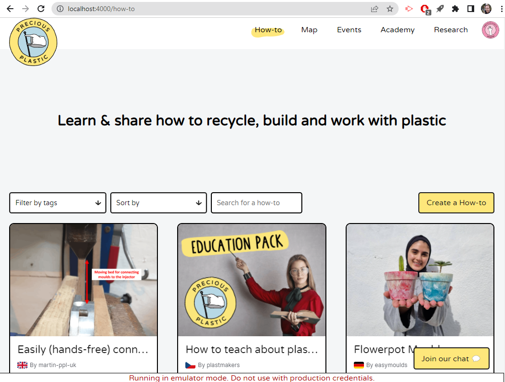
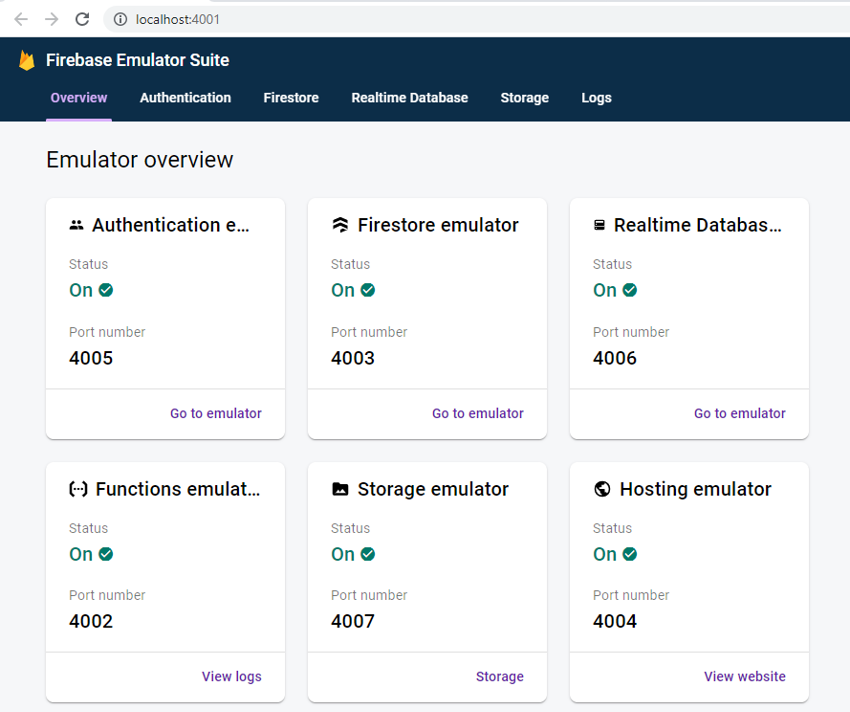
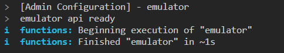
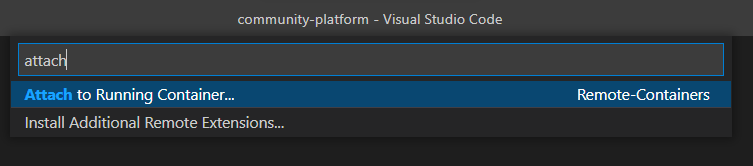

# Introduction

To run backend functions locally, Firebase provides a suite of emulators to mimic most functionality seen online (e.g firestore, storage, functions, triggers etc.)

For simplicity, although each service is an individual emulator and we are running multiple services, we will refer to them all a emulator.

# Getting started

We start the frontend and backend separately, so we have two different commands. Generally, for development, you would have both commands running at the same time in different terminals.

## Prerequisites

The emulator can be a bit tricky to setup and populate with seed data, so a Docker image has been created that contains all the necessary setup.

You will need to be able to run `docker-compose` commands on your local machine.

The easiest way to do that is to install [Docker Desktop](https://docs.docker.com/desktop/).

You can ensure it is running with:

```sh
docker-compose -v
# Docker Compose version v2.20.3
```

## Commands

To make things easier, some Yarn commands were created.

### Starting the frontend

```
yarn run frontend:watch:for-emulated-backend
```

This is similar to `yarn run start` but configures the frontend to connect to the local backend.

### Starting the backend

```
yarn run backend:emulator:watch
```

This starts the Firebase emulator, loads code into it, and watches for changes. There is initial data but any changes will be lost after the emulator is stopped.

### Stopping the backend

Due to some technical limitations, the `CTRL+C` keyboard shortcut may not stop the emulator, so it may be necessary to run:

```
yarn run backend:emulator:stop
```

## Note

It is assumed that all of these commands will be ran from the root directory of the project. Running them from elsewhere may cause issues.

## Visiting the frontend

The frontend should start at [localhost:4000](http://localhost:4000). You should see a small banner at the bottom of the page that informs emulators are in use.



## Visiting the emulator dashboard

The emulator should start at [localhost:4001](http://localhost:4001).



Clicking on tabs will take you to a page similar to the Firebase console, from where you can interact with individual services.

## Seed data

The emulator loads hardcoded data and any changes are only stored in temporary memory. No changes are kept between sessions.

You may experience some strange data issues but that is probably due to the browser's caching mechanisms. You can verify that by using another browser; in that case the original browser's indexeddb cache would need to be manually cleared.

### User logins

The seed comes preloaded with some user accounts. When it is running, you can see a complete list at [localhost:4001/auth](http://localhost:4001/auth).

Examples:

Admin user account:

```
email: admin@example.com
password: wow_backend_development_is_fun
```

Normal user account:

```
email: normal_jim@example.com
password: thanks_emulator_man
```

### Improving it

You can improve the seed data by making changes via the application or Firebase UI, exporting it, and making a pull request. This will help make development/testing easier for you and others in the future.

1. Get the container name using `docker ps`.

2. Run the export script:

```
docker exec -it <name> /app/easy-export.sh
```

3. Transfer the data from the container to your machine:

```
docker cp <name>:/app/dump ./functions/data/
```

4. Delete the current `emulator` folder.

5. Rename the `dump` folder to `emulator`.

6. But note, each folder in the export must be checked into Git. If not, this will cause problems with seeding. By default, Git does not track empty folders, so you must force it to track it by adding a .gitkeep file to the folder.

## Function development

### Writing functions code

The emulator binds to the `functions/dist` folder so that changes made will be reflected in the emulator. On Linux these changes should be picked up immediately. On Windows the changes are not always detected and may require spinning the emulator down and then starting back up.

### Invoking functions

Functions can be invoked in different ways depending on their trigger type.

For functions triggered by storage or database changes, making changes directly on the dashboard or from the frontend should trigger the corresponding function.
Similarly callable functions should be called triggered from frontend code.

For functions triggered by http request you can call directly either from command line, a web browser or REST client such as [Insomnia](https://insomnia.rest/)

E.g. calling the emulator `seed-users-create` function via a GET request:

```
http://localhost:4002/demo-community-platform-emulated/us-central1/emulator/seed-users-create
```



Read more about [connecting your app to the Cloud Functions Emulator](https://firebase.google.com/docs/emulator-suite/connect_functions).

### Accessing logs

If the emulator throws an error you may want to check generated debug.log files. These will exist in the container in the root `/app` folder.

You can access the file system within the docker container directly using the
[Remote-Containers](https://marketplace.visualstudio.com/items?itemName=ms-vscode-remote.remote-containers) extension for vscode, and running the command to `attach to running container`.



Once running in the container you can open the `/app` folder to view files


Alternatively you can request Docker to execute commands directly on the container, e.g.

```
docker exec -it <name> ls
docker exec -it <name> cat /app/firestore-debug.log
```

The `name` can be retrieved by running `docker ps`.

## Troubleshooting

See the `/functions/emulator/Dockerfile` for some debugging tips.
