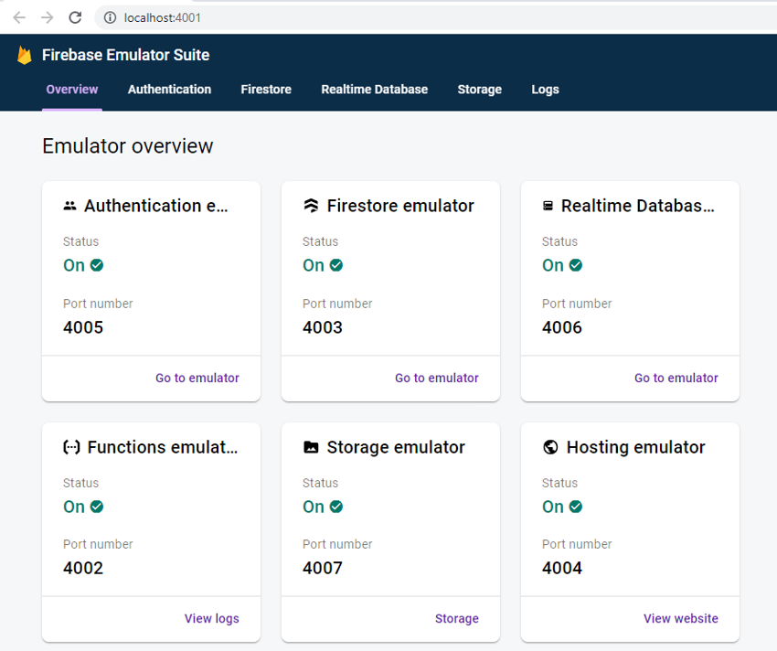

In order to test backend functions locally, firebase provides a suite of emulators to mimic most functionality seen online (e.g firestore, storage, functions, triggers etc.)

The emulators can be a bit tricky to setup and populate with seed data, and so instead an image has been created in docker that contains all the code to run the emulators and functions code

## Prerequisites

You will need to be able to run `docker` commands locally, the easiest way is to install [Docker Desktop](https://docs.docker.com/desktop/)

You can ensure it is running with the command `docker -v`

```sh
docker -v
# Docker version 20.10.14, build a224086
```

## Getting Started

```
yarn start:emulated:docker
```

This will start the following:

- **Docker emulator**  
  May take a few minutes to download the required image

- **Functions src watcher**  
  To recompile functions on update

- **Platform server**  
  On port 4000 to indicate that it should communicate with emulators instead of live site)

## Emulator Dashboard

The emulator should start at http://localhost:4001. Follow the link to see an overview of the available services



Clicking on individual tabs will take you to a page similar to the firebase console, from where you can interact with services.

Note - any data populated into the emulator will be deleted after the emulator has closed (restoring to original state). See the section below about persistent and seed data

## Resetting seed data

When the emulator is stopped the image is destroyed, so each time the emulators are restarted a clean set of data will be available.

If using the frontend data changes may still persist due to the browser's own caching mechanisms. In this case the browser indexeddb cache will need to be manually cleared

## Frontend

The frontend should start on http://localhost:4000
You should see a small banner at the bottom of the page that informs emulators are in use.


The data that appears will have been exported at the time the image was made, and so may be slightly outdated when compared to the live site. You can see the time the data was last exported.

You can see the version of data used in the command line output, e.g. data exported from precious plastic


### User Login

By default the image comes preloaded with user auth accounts as found in [shared\mocks\authUsers.ts](https://github.com/ONEARMY/community-platform/tree/master/shared/mocks/authUsers.ts). This means you can login as any of these users, e.g.

```
email: 'demo_admin@example.com',
password: 'demo_admin',
```

## Function Development

### Writing functions code

The emulators bind to the `functions/dist` folder so that changes made will be reflected in the emulators. On linux these changes should be picked up immediately, and so live-reload can be added for functions development via `yarn workspace functions watch`

If running on windows the changes are not always detected, and may require spinning the emulators down and then starting back up

### Invoking functions

Functions can be invoked in different ways depending on their trigger type.

For functions triggered by storage or database changes, making changes directly on the dashboard or from the frontend should trigger the corresponding function.
Similarly callable functions should be called triggered from frontend code.

For functions triggered by http request you can call directly either from command line, a web browser or REST client such as [Insomnia](https://insomnia.rest/)

E.g. calling the emulator `seed-users-create` function via a GET request:

```
http://localhost:4002/community-platform-emulated/us-central1/emulator/seed-users-create
```


### Accessing Logs

If the emulator throws an error you may want to check generated debug.log files. These will exist in the container in the root `/app` folder.

You can access the file system within the docker container directly using the
[Remote-Containers](https://marketplace.visualstudio.com/items?itemName=ms-vscode-remote.remote-containers) extension for vscode, and running the command to `attach to running container`


Once running in the container you can open the `/app` folder to view files


Alternatively you can request docker to execute commands directly on the container, e.g.

```
docker exec -it community-platform-emulator ls
docker exec -it community-platform-emulator cat /app/firestore-debug.log
```

## Extending the image

The code used to build the docker image can all be found in the [packages/emulators-docker](https://github.com/ONEARMY/community-platform/tree/master/packages/emulators-docker) workspace.

### Updating seed data

Admins can export data online via google cloud console. Once exported it should be formatted in a namespaced way (e.g. `pp-yyyy-mm-dd` for data exported from precious-plastic) and placed in the seed_data folder for the emulators-docker workspace.

Additionally any references to the previous data should be replaced with the updated (e.g. github action, gitignore and default config defined in workspace common.ts file)

### Custom Image

A custom image can be built and run by passing custom repo or tag args to the build script, e.g.

```
yarn workspace oa-emulators-docker build --repo=my_custom_repo --tag=my_custom_tag
```

If just intending to test locally a blank `--repo=` can be provided to avoid trying to pull an image from dockerhub and run locally

```
yarn workspace oa-emulators-docker build --repo=
```

```
yarn start:emulated:docker:local
```

## Troubleshooting

### Known Issues

See list of known issues in the workspace [README](https://github.com/ONEARMY/community-platform/tree/master/packages/emulators-docker)
