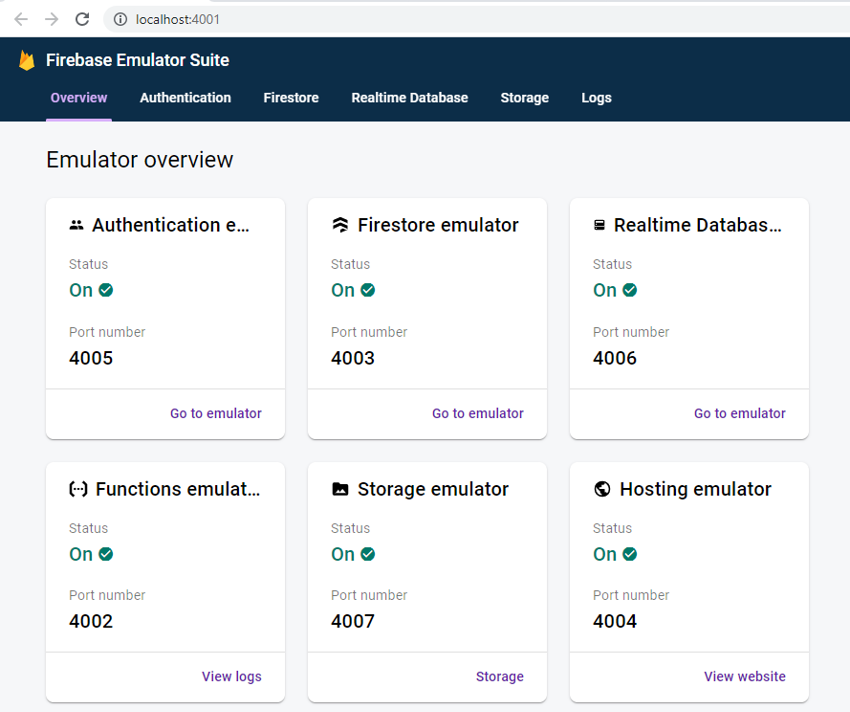
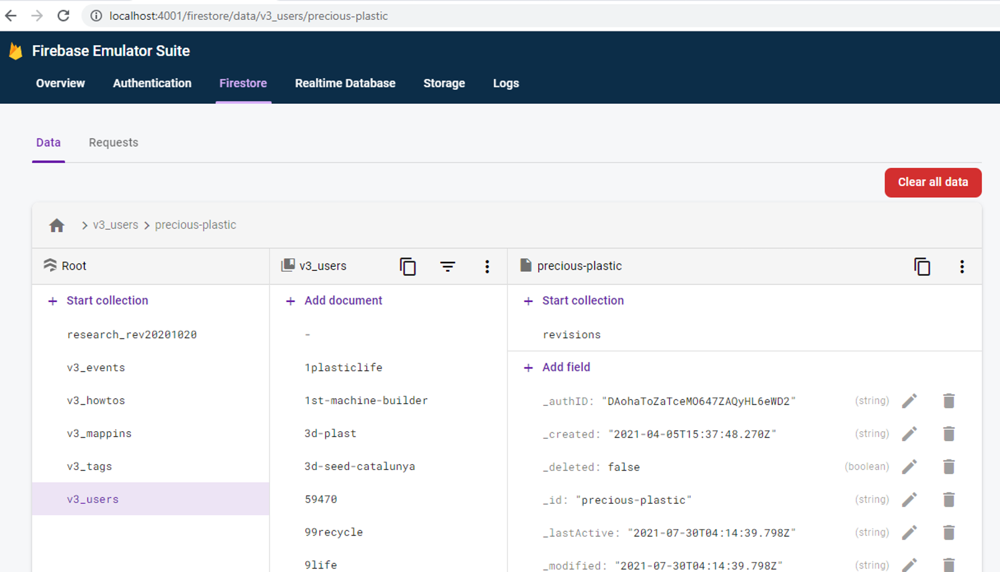
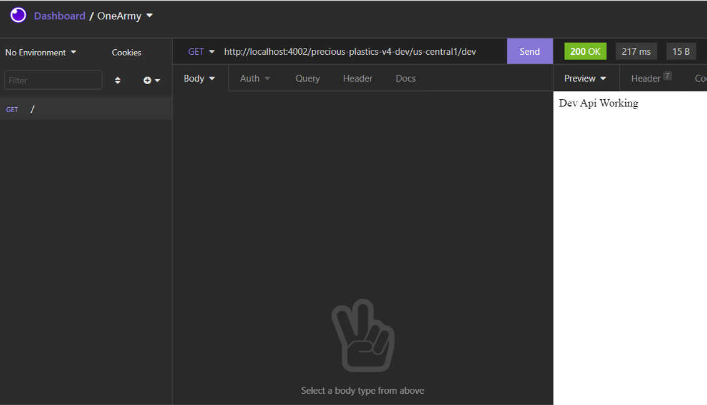

# Firebase Emulators

In order to test backend functions locally, firebase provides a suite of emulators to mimic most functionality seen online (e.g firestore, storage, functions, triggers etc.)

In order to use the emulators run the following start script

## Prerequisites

To run emulators locally you will need (as described in: https://firebase.google.com/docs/emulator-suite/install_and_configure)

- [Firebase CLI](https://firebase.google.com/docs/cli) version 8.14.0 or higher
- [Java](https://openjdk.java.net/install/) version 1.8 or higher

## Getting Started

```
yarn start:emulated
```

This will start the following:

- **Functions emulator**  
  May take a few minutes to download required binaries when running for the first time

- **Functions src watcher**  
  To recompile functions on update

- **Platform server**  
  On port 4000 to indicate that it should communicate with emulators instead of live site)

## Emulator Dashboard

The emulator should start at http://localhost:4001. Follow the link to see an overview of the available services



Clicking on individual tabs will take you to a page similar to the firebase console, from where you can interact with services.

Note - any data populated into the emulator will be deleted after the emulator has closed (restoring to original state). See the section below about persistant and seed data

# Seed data

By default the emulators load any data found in the [functions/data/emulated](../../../../functions/data/emulated) folder, which can be previously exported from another firebase app or emulator instance.

By default this data is not committed to the repo and so initial data will be empty, however specific zip files have been generated from site backup files and can be loaded for testing

## Loading seed data

By default when the script first runs it will populate seed data from [functions/data/seed](../../../../functions/data/seed). This can be repopulated either by deleting the [functions/data/emulated](../../../../functions/data/emulated) folder, or by manually calling the seed data script:

```
yarn workspace functions run emulator:seed
```

This will load the default seed data from the zip file [functions/data/seed](../../../../functions/data/seed/seed-default.zip).

The default data contains a snapshot of most howtos, mappins etc. from the export data of the file (so may not be fully up-to-date). It also includes 2 user profiles for login:

```
username: demo_user@example.com
password: demo_user
```

```
username: demo_admin@example.com
password: demo_admin
```

If you need newer or other data sources contact the repo admins who can hopefully help out.

The fully seeded database should look something like this:



## Updating seed data

When the emulators close they discard any changes made, so seed data documents that have been updated will revert to their original state next time the emulator is loaded.

Whilst this is useful to preserve a clean testing state, sometimes it might be desirable to persist changes (such as adding additional auth users, or specific example docs)

This can be achieved by passing the `--export-on-exit=./path/to/export/folder` flag to the script that starts the functions emulators. This can be run by modifiying the functions start at [functions/scripts/start.ts](../../../../functions/scripts/start.ts)

```js
// change this value if also wanting to export data
if (false) {
  cmd = `${cmd} --export-on-exit=${EMULATOR_IMPORT_FOLDER}`
}
```

NOTE - due to filepath handling this is usually best done on a mac/linux device (windows export formattedly inconsistently for linux)

## Resetting seed data

As previously mentioned, all data will be reverted back to original/seed state after emulators have closed, so there is no need to reset. If manually exported data has been copied to overwrite the seed data, the default seed can be restored using the load script above.

# Calling Functions

## HTTP Functions

E.g. A development and testing API has been created at [functions/src/dev/index.ts](../../../../functions/src/dev/index.ts). When running it can be called by making a GET request to:

```
http://localhost:4002/{projectId}/us-central1/dev
```

Where the projectId may be specified from configuration (default for emulators is `emulator-demo`)

Using a REST client like [Insomnia](https://insomnia.rest/) or [Postman](https://www.getpostman.com/) can simplify the process of making api requests

_E.g. Insomnia Rest Client_


# Authentication

By default emulators allow full read/write access to all resources, however firebase functions still expect an authenticated user in order to access various external APIs before completing operations.

The current workaround for this is authenticating using a custom service-account that has limited (read-only) access to resources on the testing project. This is done automatically during the start script [functions/scripts/start.ts](../../../../functions/scripts/start.ts).

Alternatively developers can request access to join the firebase project for full access to the testing project, however it's hoped that this is not required.

# Troubleshooting

## Port in use

_Error Message_  
`Error: Could not start Database Emulator, port taken.`

Should see exact issue in warning, e.g.
`! firestore: Port 4003 is not open on localhost, could not start Firestore Emulator.`
Or
`Something is already running on port 4000.`

Try to identify what is already running, and if required kill the process. Methods may differ depending on operating system, here are a couple examples:

_Windows: List processes on port 4003_

```c
netstat -ano | findstr 4003

/* example output */
TCP    127.0.0.1:4003         0.0.0.0:0              LISTENING       8272
```

_Windows: Kill process_

```c
taskkill /F /PID 8272
```

_Linux: List processes on port_
See a few examples at: https://stackoverflow.com/questions/11583562/how-to-kill-a-process-running-on-particular-port-in-linux/32592965
e.g.

```
sudo apt-get install lsof
```

```
npx cross-port-killer 4003
```

## Firestore Emulator fatal error

If one of the emulators throws a fatal error you might see a vague error message such as:

```
⚠  firestore: Fatal error occurred:
   Firestore Emulator has exited with code: 1,
   stopping all running emulators
```

Usually a more informative log can be found in a created log file, e.g. [firestore-debug.log](../../../../functions/firestore-debug.log)

```
Exception in thread "main" com.google.cloud.datastore.core.exception.DatastoreException: /mnt/c/apps/oneArmy/community-platform/functions/data/emulated/firestore_export/all_namespaces\all_kinds\all_namespaces_all_kinds.export_metadata (No such file or directory)
	at com.google.cloud.datastore.emulator.impl.ExportImportUtil.parseBackupFile(ExportImportUtil.java:316)
	at com.google.cloud.datastore.emulator.impl.ExportImportUtil.fetchEntities(ExportImportUtil.java:62)
	at com.google.cloud.datastore.emulator.firestore.CloudFirestore.main(CloudFirestore.java:90)
Caused by: java.io.FileNotFoundException: /mnt/c/apps/oneArmy/community-platform/functions/data/emulated/firestore_export/all_namespaces\all_kinds\all_namespaces_all_kinds.export_metadata (No such file or directory)
	at java.base/java.io.FileInputStream.open0(Native Method)
	at java.base/java.io.FileInputStream.open(FileInputStream.java:219)
	at java.base/java.io.FileInputStream.<init>(FileInputStream.java:157)
	at com.google.cloud.datastore.emulator.impl.ExportImportUtil.parseBackupFile(ExportImportUtil.java:312)
```

In this example it is trying to locate the seed data which does not exist, so to fix run the seed command

```
yarn workspace functions run emulator:seed
```

There might be similar issues logged in [firesbase-debug.log](../../../../functions/firebase-debug.log), however this file might be deleted on exit so will require opening before crash
