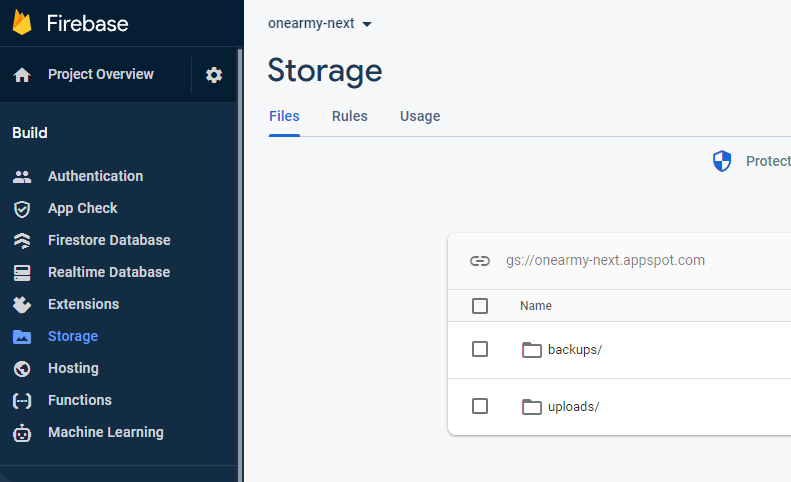
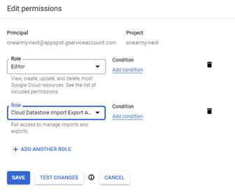
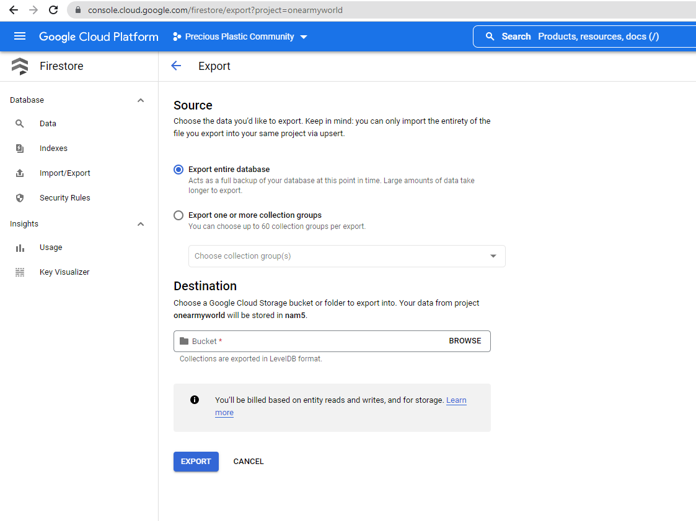

## Automated Backups

The platform includes a firebase function to automatically create a database backup on a schedule.
Currently a backup is created as part of the [weeklyTasks](https://github.com/ONEARMY/community-platform/blob/49fa7433cf4a9e348a4436d55fd3313daa70edda/functions/src/scheduled/tasks.ts) schedule, triggered every Sunday at 2am

The backup only takes an export of database tables currently in use. For backups of the entire database see [Manual Backup](#manual-backup) below

The export will automatically be populated into the default storage bucket, in an _backups_ folder

### Configuring Permissions

In order to allow automated backups, additional permissions likely be required on the service account that firebase uses. By default this should be the account named

`PROJECT_ID@appspot.gserviceaccount.com`

Permissions can be configured on the [Google Cloud IAM](https://console.cloud.google.com/iam-admin/iam) page. As a minimum, **Cloud Datastore** access will be required

See more info at:  
https://cloud.google.com/firestore/docs/manage-data/export-import

## Manual Backup

Full or custom backups of the database can be created from the [Firestore Import Export](https://console.cloud.google.com/firestore/import-export) page on Google Cloud console

## Restoring Backups

Backups can also be restored from the Firestore Import Export page

:::danger
Any existing data may be replaced and lost during restore operations
:::

Alternatively the backup could be loaded into the emulator and data queried from there as required.  
See the [Firebase Emulators](./firebase-emulators-docker.md) for more information
