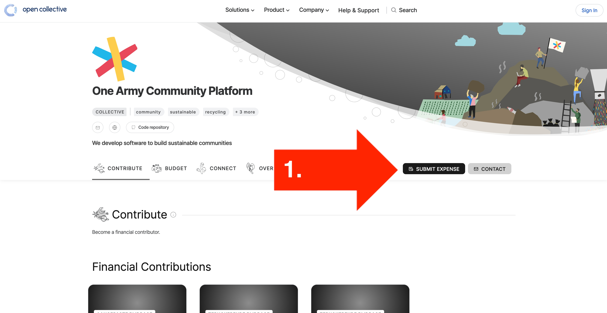
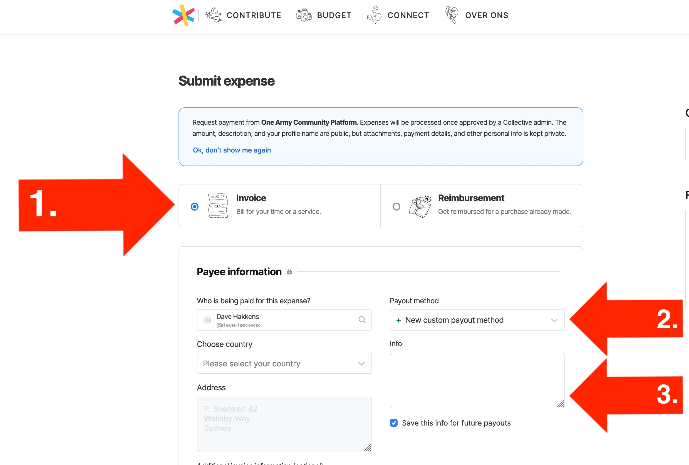

# Bounties

As a way of saying thanks to developers for their time, we've implemented a small bounty system to reward feature development.

## How do I find bounty issues?

Simply go to the `Issues` page on github and look for issues with labelled with [Bounty](https://github.com/ONEARMY/community-platform/issues).

_Note_ - There are 3 different bounty levels. You can see in the issue which level it is.

---

## How much are they?

Simply go to the `Issues` page on github and look for issues with labelled with [Bounty](https://github.com/ONEARMY/community-platform/issues).

| Level                               | Amount | It should take...                                           | E.g.                                |
| ----------------------------------- | ------ | ----------------------------------------------------------- | ----------------------------------- |
|  | €20    | Roughly 1-2 hours work for a junior/intermediate developer  | Small bugfixes, UI tweaks           |
|  | €40    | Roughly 3-5 hours work for an intermediate/senior developer | Minor feature, e.g. Howto search    |
|  | €85    | Roughly 6+ hours work for a more senior developer           | Major feature, e.g. Research module |

---

## How do I claim bounties?

#### Step 1 - Assign the issue

Drop a message in the issue thread to say that you are interested taking it on. If the issue is already assigned, or we think it might be too much for a new or individual contributor we might suggest looking at other issues instead. Otherwise it's all yours :D

#### Step 2 - Do the work

Once assigned try to complete the issue within the next month. Once complete make a PR, which will get reviewed and merged (maybe with some minor edits requested, or new issues created for future dev work)

#### Step 3 - Claim the Bounty on Open collective

Once the PR is merged you can claim the bounty. We handle payments through [Open Collective](https://opencollective.com/onearmy). Follow the link and register as a contributor to the project. Use your Paypal details.

#### Step 4 - Submit an expense

Go to our [Open Collective](https://opencollective.com/onearmy) page and Submit an expense

#### Step 5 - Add details

Ideally you collect your bounties monthly and only add one expense to reduce transactions and administration. That said, if you like to claim it right away go for it :) Do make sure to add a link to the issues that had the bounties on it.

1. Select Invoice
2. Add Paypal
3. Add links to the issues you are claiming

#### Step 6 - Receive payment

We don't have a fixed payment schedule. But for sure it will be once a month.

## What if I don't want the bounty?

No problem, thanks for the help :) We will keep the funds for future development

---

## What if I want to contribute in other ways?

That's awesome! As well as the bounty system we also encourage anyone interested to join our Core Developers or Maintainers team.

These roles include tasks like:

- Code reviews
- Code quality improvements
- Devops and general optimisations
- Security and general updates
- Documentation
- Issue management

There is a separate hourly pay scale for these roles, aimed at developers who help a bit more consistently at around 2-3h per week. If you're interested in these roles then feel free to reach out on slack or during the monthly dev call.
