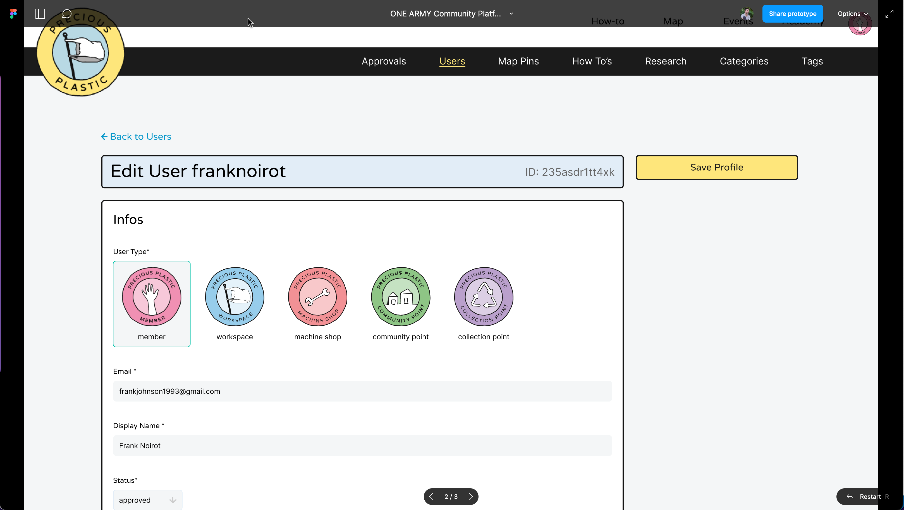
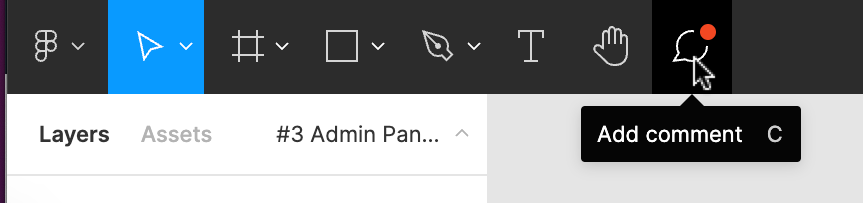

# How to contribute through feedback on designs

If you're not looking to design you can still help out in a huge way by providing feedback on designs and features as they're created. Here's how.

## Step 1: follow a link

Links to new designs ready for feedback will be posted in places like the Discord channels mentioned in [Our Design System](/Design/our-design-system). The first step is to follow the link, and sign up for any accounts you need to view the materials (a [Figma account is free](https://www.figma.com/signup) and can be made with a Google account if you have one).

## Step 2: navigate around Figma

In Figma there are two viewing modes: Design mode and Prototype mode.

If a feature has a very clear flow of how it is used, you may be taken into Prototype mode. Here you can scroll around the designs like a normal web page, as well as click around the designs to find interaction points (highlighted in blue whenever you click). If there are not interaction points you can use the left and right arrows on your keyboard to navigate between designs.

More often you will be linked to Figma in Design mode. You can zoom in and out by scrolling with your mouse while pressing the `Ctrl` key (`Cmd` key on Mac), or by pinching on a laptop mousepad. You can pan around the design canvas in 4 ways:

1. Two-finger scroll on a laptop mousepad.
2. Tap the `h` key to select the Hand tool, then click and drag around.
3. Click and drag around while holding the `Space bar` key.
4. Scroll with a mouse while holding down the `Ctrl/Cmd` key to pan vertically, adding the `Shift` key to pan horizontally.

In both cases, navigate around the provided link to get a sense of what is up for review, and keep in mind what questions the designs have left you with as you navigate through them.

## Step 3: use the comment tool

Once you have reviewed the design work, you can leave feedback and questions for the designers directly in Figma. This lets the designers see exactly what you’re commenting on within the designs

If you’re more comfortable, it’s also okay to leave a comment in the Discord thread that the review was started from, just try to use descriptive language about where each of your comments and questions relate to within the designs. For example, “In the mockup showing the filters being applied, is there any way for the user to remove already-applied filters?”

The Figma Comment tool can be selected by tapping the `c` key or clicking on the comment bubble icon in the top-left toolbar. From there you can either click where you want to leave a comment on a point, or click and drag to leave a comment over an area. Feel free to tag the designer, `@davehakkens`, and/or `@franknoirot` in the comment, which will send a notification to their Figma accounts.

And that’s it! Thank you so much for your interest in making Community Platform a better tool. Feedback on designs is at least as important as the designs themselves: it is critical for our team to build the best tool we can for everyone, and not just build what we think works.
