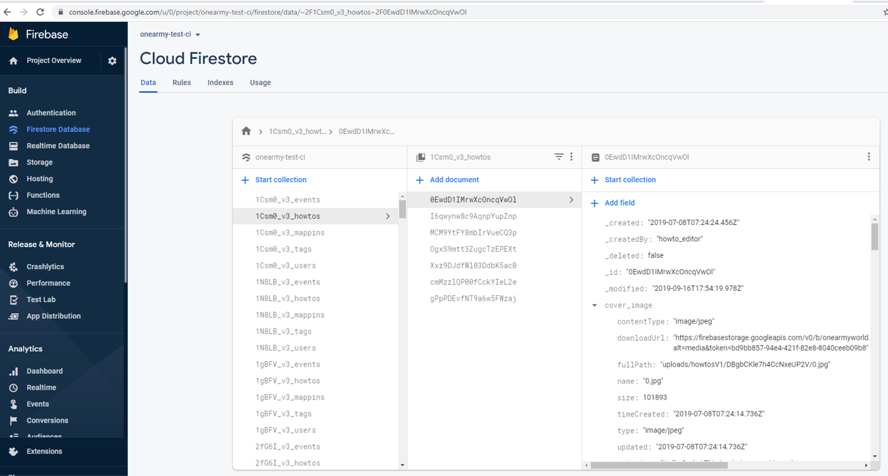

# E2E Testing

End-to-end testing is carried out by [Cypress](https://www.cypress.io/), and executed against a dedicated firebase project (different to development and staging).

You will notice the data in test is completely different to what you see when developing. In addition, the testing app starts at the port `localhost:3456` which all tests are run against.

The tests are not comprehensive, but are slowly being built over time - particularly when bugs are noticed. Therefore if you identify a bug, before fixing it is recommended to add a test so that the bug is less likely to resurface in the future.

## Getting Started

```
yarn workspace oa-cypress install
yarn workspace oa-cypress start
```

(or shorthand `yarn test`)

### Data Seeding

A standard set of database documents are created at the start of every test and cleared at the end. These are populated from the `fixtures/seed` folder to the online firebase firestore database.

They will be automatically deleted after tests have completed running

### CI testing

Tests are automatically run on every pull request, and can be viewed on the cypress dashboard. A link to the specific test run will be populated into the PR, or publicly viewable at: https://dashboard.cypress.io/projects/4s5zgo/runs

### Parallel testing

When testing is initiated a random prefix is generated to uniquely seed/clear the database (e.g. `test1_howtos` and `test2_howtos`) and avoid different tests interfering with each other. This allows us to test multiple specs in parallel when running on ci.

### Browser testing

Currently testing is carried out against chrome(stable) and firefox(latest) browsers. We are not able to support any additional browsers (e.g. safari) via ci as they are not currently supported by cypress. If this changes in the future then it would be good to add. See discussion around this here: https://github.com/ONEARMY/community-platform/issues/611

### DB Teardown

In case of test fail, documents will not be deleted from the server. This is not a major issue as they all are randomly prefixed, and will just sit in the database. From time-to-time admins may decide to delete any hanging data via the firebase cli.

```
firebase use ci
firebase firestore:delete --all-collections
```

:::warning
The command will completely wipe the database, and so should only be used on the ci project when required. If needing access to the ci project ask one of the platform admins who can send an invite
DO NOT USE AGAINST STAGING OR PRODUCTION SITES!!!
:::

_CI Project - firestore with uncleared data_

